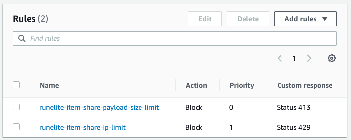
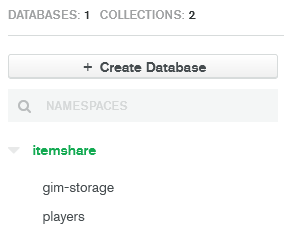
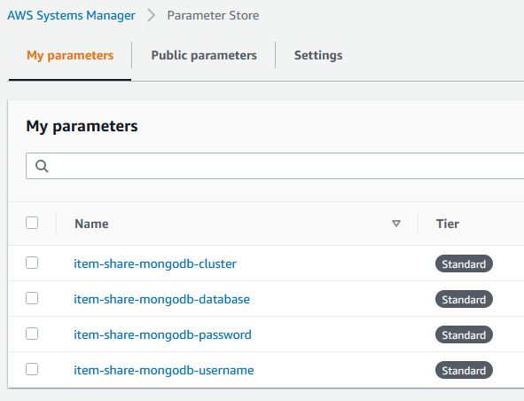
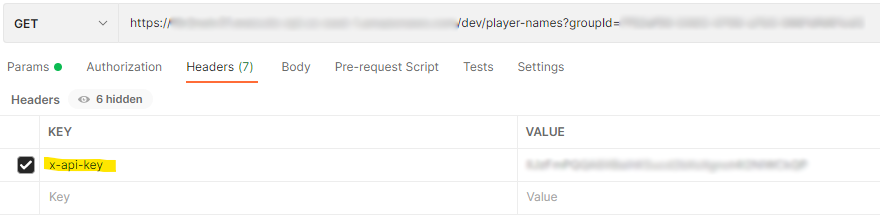

# Runelite Item Share AWS

This project uses the `serverless` framework to deploy code to AWS

https://www.serverless.com

## Prerequisites:

* `serverless` is installed on your machine

  * https://www.serverless.com/framework/docs/getting-started/

* You have an AWS account and it's configured to authenticate with your machine

  * https://www.serverless.com/framework/docs/providers/aws/guide/credentials/

* The AWS user you authenticate with has the following permissions

  

* You have a Web ACL created in AWS named `runelite-item-share-firewall`

  * Add any rules you would like to restrict what requests are allowed

  * The dedicated server currently runs the following:

    

* You have a MongoDB server running somewhere

  * A free tier server is available at https://www.mongodb.com/cloud/atlas/register

  * The MongoDB server has a database named `itemshare` and 2 collections named `gim-storage` and `players`

    

  * Add your MongoDB server values to the AWS parameter store: 
    * `item-share-mongodb-cluster`
    * `item-share-mongodb-database`
    * `item-share-mongodb-password`
    * `item-share-mongodb-username`

      

## Deploying the server

* Open a terminal to the root directory of this project

  * Run `serverless deploy`

* The terminal will print the API Endpoint URLs and API Key `runelite-item-share-api-key`

  * The value of `runelite-item-share-api-key` needs to be put in the `x-api-key` header for all requests to the API

  * Example in postman:

    