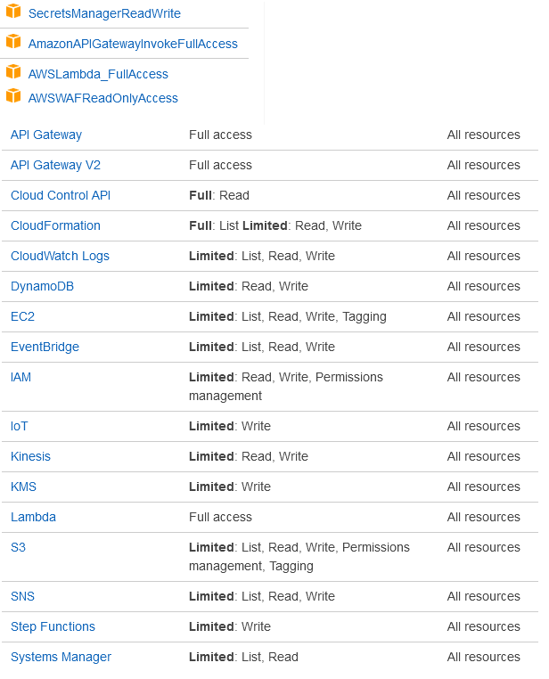

# Runelite Item Share AWS

This project uses the `serverless` framework to deploy code to AWS

https://www.serverless.com

## Prerequisites:
* `serverless` is installed on your machine
  * https://www.serverless.com/framework/docs/getting-started/

* You have an AWS account and its conifgured on your machine
  * https://www.serverless.com/framework/docs/providers/aws/guide/credentials/

* The AWS user you authenticate with has the following permissions

  

* You have a Web ACL in AWS named `runelite-item-share-firewall`
  * Add any rules you would like to restrict what requests are allowed

## Deploying the server
* Open a terminal to the root directory of this project
  * run `serverless deploy`
* The terminal will print the API Endpoint URLs 
* The terminal will print the value of the API Key `runelite-item-share-api-key`
  * This is used in the `x-api-key` header of a request to the API